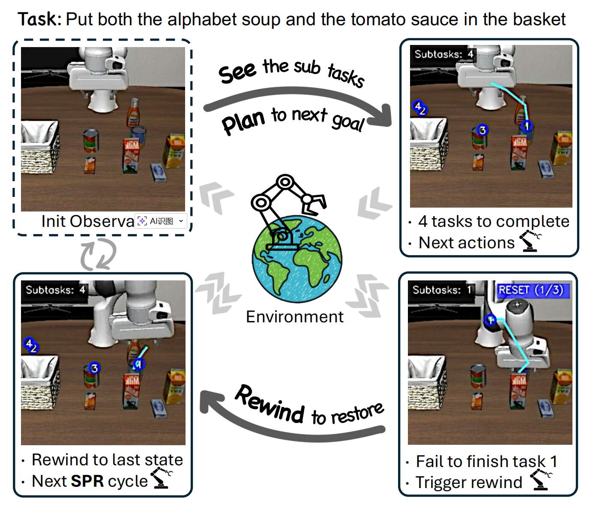

<div align="center">
  <h1>See, Plan, Rewind<br>Progress-Aware Vision-Language-Action Models<br>for Robust Robotic Manipulation</h1>
</div>

<p align="center">
  <a href="https://tingjundai.github.io/SPRVLA">
    
  </a>
  <a href="https://huggingface.co/SPRVLA">
    
  </a>
</p>

---

## Table of Contents

1. [Overview](#1-overview)
2. [Model Zoo](#2-model-zoo)
3. [Installation](#3-installation)
4. [Evaluation (LIBERO)](#4-evaluation-libero)
5. [Training](#5-training)
6. [Datasets](#6-datasets)
7. [Citation](#7-citation)
8. [Acknowledgement](#8-acknowledgement)

---

## 1. Overview

<div align="center">
  
</div>

We introduce **S**ee, **P**lan, **R**ewind (SPR), a progress-aware vision-language-action framework that grounds task progress in concrete 2D spatial subgoals. SPR operates through a continuous cycle: **Seeing** remaining subtasks with spatial coordinates, **Planning** trajectories to the next waypoint, and **Rewinding** to escape erroneous states when progress anomalies are detected. Unlike prior methods relying on abstract progress signals or auxiliary recovery models, SPR achieves fine-grained spatial monitoring and data-efficient error recovery within a single unified model. SPR sets state-of-the-art on LIBERO and LIBERO-Plus benchmarks, and generalizes to challenging real-robot tasks where the baseline fails entirely.

---

## 2. Model Zoo

| Model | Task Suite | Description | Checkpoint |
|-------|-----------|-------------|------------|
| SPRVLA-7B-LIBERO-Spatial | LIBERO-Spatial | Fine-tuned on LIBERO-Spatial tasks | [SPRVLA/libero_spatial](https://huggingface.co/SPRVLA/libero_spatial) |
| SPRVLA-7B-LIBERO-Object | LIBERO-Object | Fine-tuned on LIBERO-Object tasks | [SPRVLA/libero_object](https://huggingface.co/SPRVLA/libero_object) |
| SPRVLA-7B-LIBERO-Goal | LIBERO-Goal | Fine-tuned on LIBERO-Goal tasks | [SPRVLA/libero_goal](https://huggingface.co/SPRVLA/libero_goal) |
| SPRVLA-7B-LIBERO-Long | LIBERO-Long | Fine-tuned on LIBERO-Long (10) tasks | [SPRVLA/libero_10](https://huggingface.co/SPRVLA/libero_10) |
| SPRVLA-7B-LIBERO-All | All LIBERO | Single checkpoint for all LIBERO suites | _Coming soon_ |

---

## 3. Installation

First install Python 3.11, then install [PyTorch](https://pytorch.org) according to the instructions specific to your operating system.

```bash
git clone https://github.com/TingjunDai/SPRVLA.git
cd SPRVLA
git checkout main  # code is on the main branch
pip install -e .[all]
```

---

## 4. Evaluation (LIBERO)

### 4.1 Environment Setup

```bash
# Install LIBERO environment
cd experiments/LIBERO
pip install -e .

# Install additional dependencies
pip install einops torchvision accelerate
pip install transformers==4.52.1
pip install vllm==0.8.5

# Required environment variable for vLLM multi-process
export VLLM_WORKER_MULTIPROC_METHOD=spawn
```

### 4.2 Run Evaluation

```bash
cd experiments/libero

# Run evaluation on a specific task suite
python run_libero_eval_vllm.py --task <task_type> --checkpoint <checkpoint_path>

# Run a specific task ID (0-9) within a task suite
python run_libero_eval_vllm.py --task <task_type> --task_id <id> --checkpoint <checkpoint_path>
```

**Available task types and examples:**

```bash
# LIBERO-Spatial (all 10 tasks)
python run_libero_eval_vllm.py --task spatial --checkpoint SPRVLA/libero_spatial

# LIBERO-Object (all 10 tasks)
python run_libero_eval_vllm.py --task object --checkpoint SPRVLA/libero_object

# LIBERO-Goal (all 10 tasks)
python run_libero_eval_vllm.py --task goal --checkpoint SPRVLA/libero_goal

# LIBERO-Long / LIBERO-10 (all 10 tasks)
python run_libero_eval_vllm.py --task 10 --checkpoint SPRVLA/libero_10

# Run only task ID 3 of LIBERO-Spatial
python run_libero_eval_vllm.py --task spatial --task_id 3 --checkpoint SPRVLA/libero_spatial
```

**Notes:**
- Each task suite contains 10 tasks (task_id: 0-9)
- Each task is evaluated over 50 episodes by default
- Results (videos and annotations) are saved under `./rollouts/`
- Multi-GPU inference is supported via vLLM tensor parallelism

---

## 5. Training

> Training code and detailed instructions will be released soon.

---

## 6. Datasets

> Datasets will be released soon.

---

## 7. Citation

> Citation information will be available upon paper release.

---

## 8. Acknowledgement

We would like to thank the following open-source projects for their great work.

- This project is built upon [MolmoAct](https://github.com/allenai/molmoact).

---
